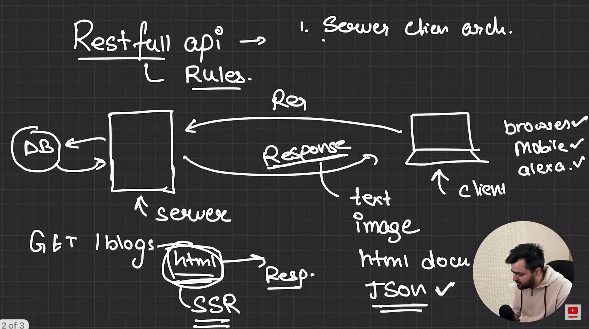
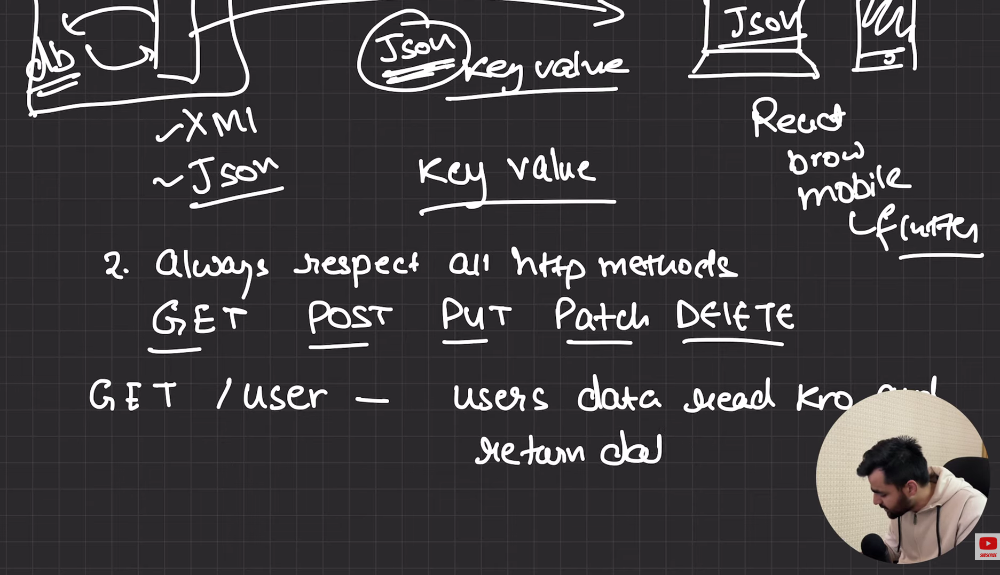
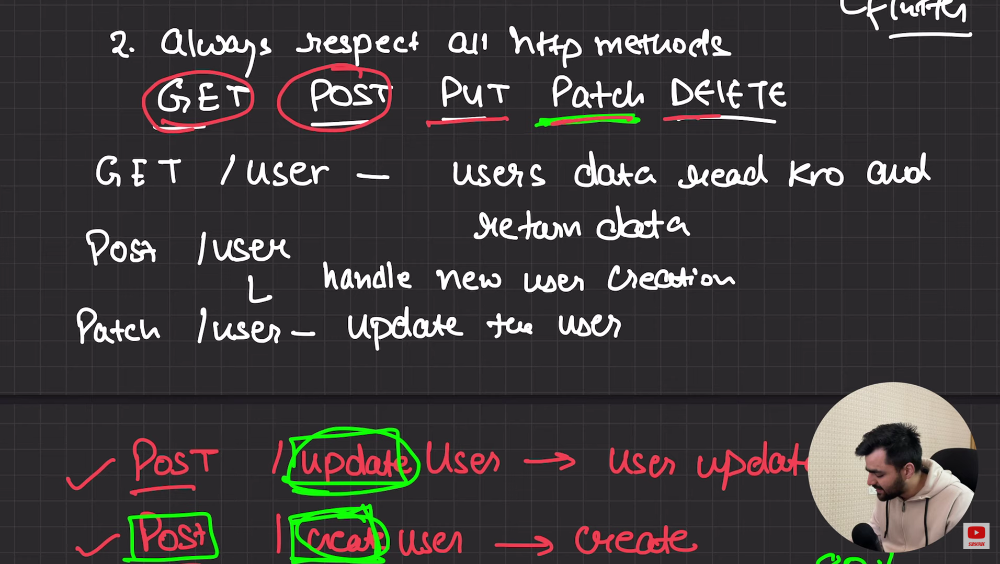
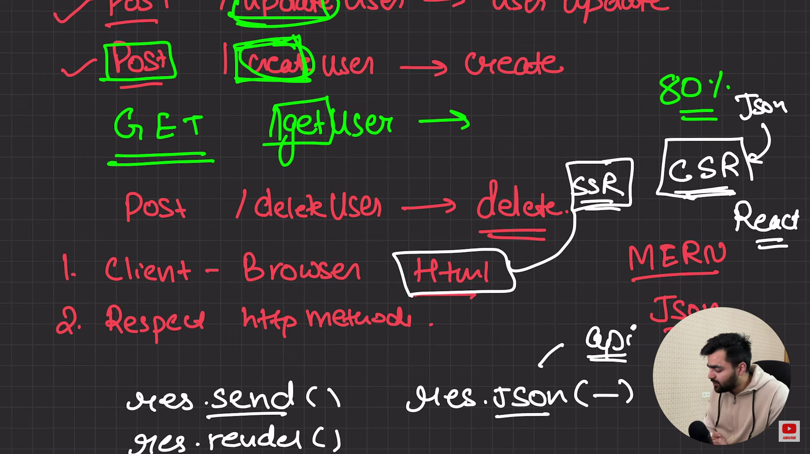

## What is an API (Application Programming Interface)

APIs (Application Programming Interfaces) are the invisible backbone of modern software development. They allow different applications and systems to communicate with each other and share data efficiently.

**Example:** 
1. A mobile/ web app uses a Weather API to show today’s temperature.
2. API's integration for seameless communication between frontend and backend systems.

   

**How APIs Work** : API works on a request–response model where the client requests data and the server sends back a response.
**Example**: Browser → API → Server → API → Browser (shows data).

APIs operate using a **request–response cycle**:

1. **Request:** The client sends a request to an API endpoint (URI)
2. **Processing:** The API forwards the request to the server
3. **Response:** The server processes the request and returns data
4. **Delivery:** The API sends the response back to the client

This communication usually happens over **HTTP/HTTPS**, with added security using headers, tokens, or cookies.


**Why Do We Need APIs?** 

APIs help applications share data, reuse functionality, and integrate with other systems.

**Example**: 
1. Using Stripe API for payments instead of building your own payment system.
2. Instead of building your own weather system, you can use the **OpenWeatherMap API** to fetch real-time weather data instantly.


## Types of API Architectures

API architectures define how systems exchange data and communicate.

### 1. REST (Representational State Transfer)

* Uses HTTP methods: `GET`, `POST`, `PUT`, `DELETE`
* Simple and flexible
* **Data Format:** JSON, XML

### 2. SOAP (Simple Object Access Protocol)

* Strict and highly secure
* Uses XML-based messaging
* **Data Format:** XML

### 3. GraphQL

* Allows clients to request only the data they need
* Reduces over-fetching and under-fetching
* **Data Format:** JSON

### 4. gRPC

* High-performance communication framework
* Uses Protocol Buffers (Protobuf)
* **Data Format:** Binary


## Types of APIs

APIs can be categorized based on accessibility and usage:

| Type               | Description                             | Examples                |
| ------------------ | --------------------------------------- | ----------------------- |
| Web APIs           | Accessible over the internet using HTTP | REST APIs, GraphQL APIs |
| Local APIs         | Used within a local OS or environment   | Windows API, .NET, TAPI |
| Program APIs       | Remote calls appear local via RPC       | SOAP, XML-RPC           |
| Internal APIs      | Used privately within an organization   | Internal microservices  |
| Partner APIs       | Shared with selected business partners  | Payment Gateway APIs    |
| Open (Public) APIs | Available for public developer use      | Twitter API, GitHub API |


## What Are REST APIs?

REST stands for **Representational State Transfer**. REST APIs follow REST architectural constraints and allow interaction with RESTful web services.

### Common HTTP Methods

* **GET** – Retrieve data
* **POST** – Create data
* **PUT** – Update data
* **DELETE** – Delete data

### Key Feature

REST APIs are **stateless**, meaning the server does not store client information between requests.


## API Integration

API Integration allows two or more systems to exchange data automatically.

### Examples

* Connecting an e-commerce platform to a payment gateway (Stripe API)
* Syncing a CRM (Salesforce) with a marketing tool

In today’s cloud-driven ecosystem, APIs are the foundation of automation and interoperability.


## API Testing

API testing verifies that APIs work as expected, focusing on logic, performance, and security rather than UI.

### Types of API Testing

* Unit Testing
* Integration Testing
* Security Testing
* Performance Testing
* Functional Testing

### Popular API Testing Tools

| Tool    | Purpose                          |
| ------- | -------------------------------- |
| Postman | Manual and automated API testing |
| SoapUI  | SOAP & REST API testing          |
| JMeter  | Load and performance testing     |
| Apigee  | Enterprise API management        |
| vREST   | Automated regression testing     |


## Restrictions of Using APIs

APIs are not typically released as downloadable software and are governed by usage policies:

* **Private APIs:** For internal use only (e.g., company microservices)
* **Partner APIs:** Shared with approved partners under agreements
* **Public APIs:** Available for general use (e.g., Windows API by Microsoft)

For a list of public APIs, visit:
[https://github.com/public-apis/public-apis](https://github.com/public-apis/public-apis)


## Advantages of APIs

* Faster development using reusable components
* Seamless system integration
* Automated workflows
* Scalable and modular architecture
* Encourages innovation


## Disadvantages of APIs

* High development and maintenance cost
* Security risks from exposed endpoints
* Versioning and backward compatibility challenges
* Dependency on third-party services


---

## HTTP and HTTPS

APIs communicate primarily using the **HTTP (HyperText Transfer Protocol)** or its secure version **HTTPS**.

### HTTP

* Stateless protocol used for client–server communication
* Data is sent in plain text
* Faster but **not secure** for sensitive data

### HTTPS

* Secure version of HTTP
* Uses **SSL/TLS encryption**
* Protects data from interception and tampering
* Required for authentication, payments, and production APIs

### Common HTTP Methods

| Method | Purpose               |
| ------ | --------------------- |
| GET    | Retrieve data         |
| POST   | Send or create data   |
| PUT    | Update existing data  |
| PATCH  | Partially update data |
| DELETE | Remove data           |

Most modern APIs **must use HTTPS** to ensure security and user trust.


## CRUD Operations in APIs

CRUD represents the four basic operations performed on data in an application.

| CRUD Operation | HTTP Method | Description          |
| -------------- | ----------- | -------------------- |
| Create         | POST        | Add new data         |
| Read           | GET         | Retrieve data        |
| Update         | PUT / PATCH | Modify existing data |
| Delete         | DELETE      | Remove data          |

### Example (User API)

| Action      | Endpoint      | Method |
| ----------- | ------------- | ------ |
| Create user | `/users`      | POST   |
| Get users   | `/users`      | GET    |
| Update user | `/users/{id}` | PUT    |
| Delete user | `/users/{id}` | DELETE |

CRUD operations are the foundation of **RESTful API design**.


## CORS (Cross-Origin Resource Sharing)

CORS is a security mechanism that controls how resources are shared between different origins (domains).

### What Is an Origin?

An origin is defined by:

* Protocol (http / https)
* Domain
* Port

Example:

* `https://example.com`
* `http://localhost:3000`

These are considered **different origins**.

### Why CORS Exists

Browsers block requests between different origins by default to prevent:

* Data theft
* Unauthorized access
* Cross-site attacks

### How CORS Works

The server sends special HTTP headers to tell the browser whether a request is allowed.

Common CORS headers:

* `Access-Control-Allow-Origin`
* `Access-Control-Allow-Methods`
* `Access-Control-Allow-Headers`
* `Access-Control-Allow-Credentials`

### Example Scenario

A frontend app running on:

```
http://localhost:3000
```

Calling an API hosted at:

```
https://api.example.com
```

Requires proper CORS configuration on the server.

### CORS in Simple Terms

> CORS is a browser security feature that decides **who can access your API and from where**.


## Preflight Requests (CORS)

For certain requests (PUT, DELETE, custom headers), browsers send a **preflight request** using the `OPTIONS` method.

* Checks if the server allows the request
* Happens automatically in the background
* Improves security before actual data transfer


## Summary

* **HTTP/HTTPS** define how data is transferred between client and server
* **CRUD operations** define how data is managed
* **CORS** controls cross-origin access to APIs
* Together, they form the backbone of secure, scalable API communication


---


# Restfull API Rules

1. Works on server client architecture.

<br/>



2. Always Respect All Http methods.
    Get , Post , Put , Delete

    Get /user - user data read kro and return kro

    Post /user - handle new user creation

    Pathch /user - Update the user

<br/>






