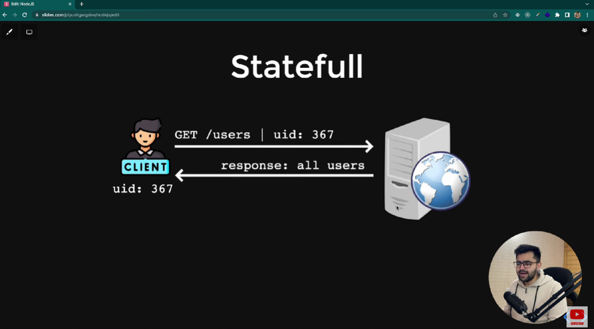
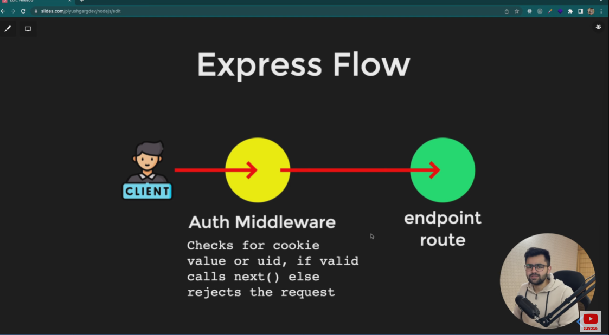

# Authentication

## Authentication Patterns
1. Statefull - Which maintains state or data on server side

2. Stateless - Which has no state.

In statefull authentication server works as a parking boy which stores the car no. with a unique mapped no.

Server gives the mapped number gives to the user as a parking ticket .

When user visit again to take the car the parking boy (server) maps the data , the user is authentic or not . If yes then server gives the permission to user to take the car.(maintain a state)

## How to transfer uid?

Server can transfer the unique id using cookies, respose , headers to the cilent.

## Express Flow

---

#### ✅ **Authentication & Authorization — Comparison Table**

#### **1. Stateful vs Stateless Authentication**

| Feature                      | **Stateful Authentication**                   | **Stateless Authentication (JWT)**                    |
| ---------------------------- | --------------------------------------------- | ----------------------------------------------------- |
| Where session data is stored | On server (session store / DB / memory)       | On client (JWT token)                                 |
| Server memory usage          | High (stores sessions)                        | Low (no session storage)                              |
| How client proves identity   | Sends Session ID (stored in cookie)           | Sends JWT token (in header or cookie)                 |
| Server validation            | Looks up session in server store              | Verifies JWT signature only                           |
| Logout                       | Server invalidates session                    | Harder (must blacklist token)                         |
| Scaling                      | Hard (sticky sessions or shared store needed) | Easy (any server can verify token)                    |
| Security                     | Very secure (tokens can be revoked anytime)   | Secure but risky if JWT stolen (cannot revoke easily) |
| Typical use                  | Traditional web apps                          | Modern SPAs, APIs, microservices                      |

#### **2. JWT vs Cookies**

| Feature               | **JWT (JSON Web Token)**               | **Cookies**                              |
| --------------------- | -------------------------------------- | ---------------------------------------- |
| What it stores        | Encoded user data + signature          | Any string (usually session ID)          |
| Storage location      | LocalStorage / SessionStorage / Cookie | Browser stores automatically             |
| Sent automatically?   | ❌ No (except if stored in cookie)      | ✔ Yes (cookies auto-attached per domain) |
| Use in authentication | Stateless auth                         | Primarily stateful session management    |
| Server lookup needed? | ❌ No                                   | ✔ Yes (for session data)                 |
| Size limit            | ~8 KB                                  | ~4 KB                                    |
| Security risks        | If stored in localStorage → XSS risk   | If not HTTP-Only → XSS risk; CSRF risk   |
| Best used for         | APIs, microservices                    | Web apps needing server-side sessions    |

#### **3. Authorization (RBAC / ABAC)**

| Concept                                   | **What It Means**                    | **Where It Happens**   | **Example**              |
| ----------------------------------------- | ------------------------------------ | ---------------------- | ------------------------ |
| **Authentication**                        | Verify **who** the user is           | Login stage            | “User is John”           |
| **Authorization**                         | Verify **what** user can do          | After authentication   | “John can access /admin” |
| **RBAC** (Role-Based Access Control)      | Users get **roles** with permissions | Server / middleware    | admin, user, manager     |
| **ABAC** (Attribute-Based Access Control) | Decisions based on **attributes**    | Server / policy engine | age > 18, region = “EU”  |

#### ✅ **4. How Each System Works (Flow Charts in Table)**

| Method                                 | Login Flow                                                                                                      | Request Flow                                                                                               | Logout Flow                                                                |
| -------------------------------------- | --------------------------------------------------------------------------------------------------------------- | ---------------------------------------------------------------------------------------------------------- | -------------------------------------------------------------------------- |
| **Stateful Auth (Sessions + Cookies)** | 1. User logs in 2. Server creates session in database 3. Server sends session ID in cookie                | 1. Browser auto-sends cookie 2. Server matches session ID → session data                                | 1. Server deletes session from DB                                          |
| **Stateless Auth (JWT)**               | 1. User logs in 2. Server creates JWT and returns to client 3. Client stores JWT (localStorage or cookie) | 1. Client sends JWT in `Authorization: Bearer <token>` 2. Server validates signature and trusts payload | 1. Client deletes token locally 2. Hard to invalidate before expiration |
| **Stateless Auth (JWT + Cookies)**     | Essentially same as JWT, but token stored in HTTP-Only cookie                                                   | Cookie auto-sent → server verifies JWT                                                                     | Remove cookie + optional server blacklist                                  |
| **Authorization (RBAC/ABAC)**          | After successful login                                                                                          | Middleware checks roles/permissions                                                                        | Not applicable                                                             |

---
JWT is a digitally signed token used for stateless authentication, containing user identity and permission data.

